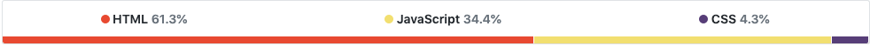
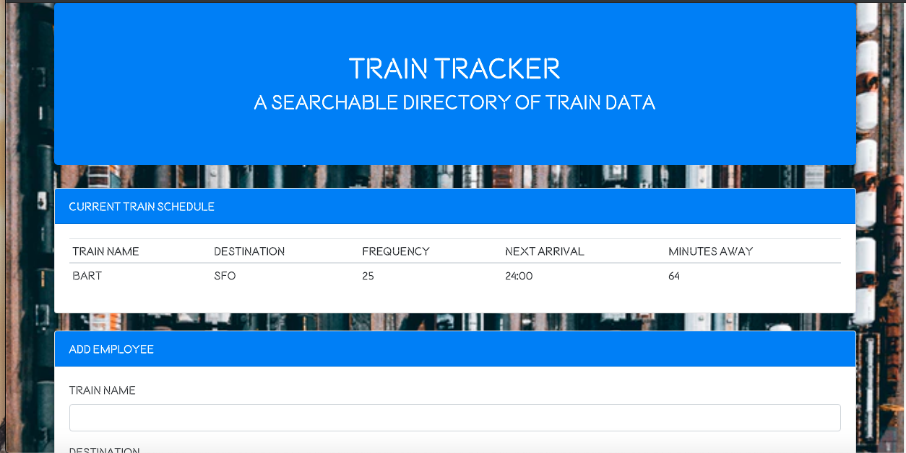

# Train-Scheduler
___

### Design
Train Tracker makes prominent use of JQuery/Bootstrap and use moderate of CSS for styling individual elements. I linked an external font style sheet for unique styling. An static background image of a train yard was formatted to cover the background-size and expand with resizing. The page header is contained within a bootstrap jumbotron with a brief description of the app function. The train table data was displayed within a bootstrap card with data being dynamically generated under hard-coded table heads. Another bootstrap card was added containing forms for Train Name, Destination, First Train Time in military time, and Frequency with unique corresponding id's.
### Logic
This application made extensive use of Firebase to store user inputs, JQuery, JavaScript, and Moment.JS. First an object was declared containing my firebase configuration credentials. Next the firebase database was intiialized utilizing these credentials. Next, a variable was declared pointing to the firebase database itself. Utilizing a JQuery on click listener function, variables were declared assigned to each input div value with white-space trimmed. Subsequently a new object named newTrain was declared inside the function containing the input variables of train data as key:value pairs. After the inputs were stored in the newTrain array, the input values in the form were cleared. Finally, the newTrain object was pushed to the database for storage.

In order to dynamically display data in the "Current Train Schedule" table the database was referenced when a new child was added. A variable pointing to the value of the snapshot within the database was then declared. A dynamically created table row was made in JQuery for proper formatting of the table. Then each stored input child from the database was assigned to a variable pointing to a JQuery table data element with the text of that child. A timestamp variable was declared assigned to the value of the stored firstTrainTime within a Moment.JS function to convert the time to military time. Next a variable determining the minutes away based on frequency at the given time was declared pointing to a JQuery dynamically generated table data element with the text value of a Moment.JS function to calculate the difference between the timestamp and arrival time at that given moment. Subsequently a conditional statement was generated to clear the display fields on the "Current Train Schedule" if the arrival time reaches zero with the JQuery clear method. Lastly all variables were appended to the table id and displayed on the DOM.

## Built With

___

* [HTML](https://developer.mozilla.org/en-US/docs/Web/Guide/HTML/HTML5)
* [CSS](https://developer.mozilla.org/en-US/docs/Web/CSS)
* [JavaScript](https://developer.mozilla.org/en-US/docs/Web/JavaScript/Reference)
* [Bootstrap](https://getbootstrap.com/docs/4.3/getting-started/introduction/)
* [JQuery](https://api.jquery.com/)
* [Moment.JS](https://momentjs.com/docs/)
* [Firebase](https://firebase.google.com/docs)

___

[Train Tracker page](https://djgoldstone.github.io/Train-Scheduler/)

___

## Authors

* Derek Goldstone - [UC Berkeley Extension](https://www.linkedin.com/in/derek-goldstone-482884a3/)

___