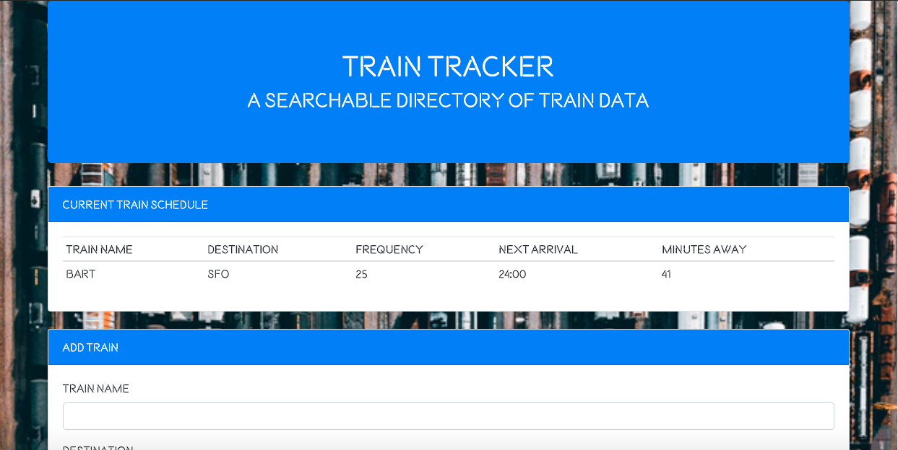

# Train-Scheduler
___

### Design
GifTastic made prominent use of JQuery/Bootstrap and use moderate of CSS for styling individual elements. I linked an external font style sheet for unique styling. An animated background image of television static was formatted to 100% of background and expand with resizing. Then a bootstrap navbar was inserted within a container. The navbar header was styled inline with two television gifs surrounding the text on either day with adjusting of the top margin for proper alignment. Inside of the navbar the instructions are listed and the div displaying buttons renders default buttons populated from an array that calls upon api keys. Outside of the navbar a search form div floats right and contains an input field that stores data values to create new buttons upon submission. Once a button is click, gifs from the corresponding show appear with an image equivalent to their rating by giphy's API displayed as an american television parental guideline rating (TV-G, TV-PG, or TV-14 in place of PG-13).  

### Logic
GifTastic required extensive use of JavaScript and JQuery. First an array of strings named topics was declared containing 10 show names. Next a function was declared that empties the buttons-div. Next a for loop is declared that iterates through the array of topics. For each element in topics a new button was dynamically generated with a class of show-btn and a corresponding data-name attribute of it's own name. The text of the button was generated and the new button was then appended to the buttons-div.

Next a function was declared to display the associated data requested from the api for each show. A variable named show was declared accessing the data-name from each show button. The query url was stored in a variable containing the api key with the show variable concatenated in the query section of the url. The shows-div was then emptied with each new click. A ajax call was made to the query url with the method of get to retrieve data. The promise then contains a variable holding the results from the api call at the key of data. I then used a for loop to iterate through the results array returned from the ajax call. A rating variable was then created accessing the rating key at index i of results followed by a dynamically generated img tag. I used a conditional statement to check the three classifications of ratings and for each possibility the img tag was given the attribute of different images corresponding to the tv rating system with a slight margin for proper formatting. Next another img tag was dynamically generated with JQuery in order to contain the gif images with a class of gif and data states to determine if the image would be static or animated on a click event. The rating image and show image were then prepended to the shows-div and displayed to the DOM. Within this same function another on click listener was declared for the gif class to change the data states of each image.

A separate on click listener was declared to take values from the show-input div and trim off excess white space. If the topics array does not already contain the value of the show-input div, the show was then pushed to the topics array. The input field at show-input was cleared of it's value on the DOM and the displayButtons function was called to render the new button while simultaneously preventing the creation of duplicate buttons by emptying the div. A click listener was declared that any click of the show-button class will cause display shows to be called. Lastly the displayButtons function was called to display default buttons to the DOM.

## Built With

___

* [HTML](https://developer.mozilla.org/en-US/docs/Web/Guide/HTML/HTML5)
* [CSS](https://developer.mozilla.org/en-US/docs/Web/CSS)
* [JavaScript](https://developer.mozilla.org/en-US/docs/Web/JavaScript/Reference)
* [Bootstrap](https://getbootstrap.com/docs/4.3/getting-started/introduction/)
* [JQuery](https://api.jquery.com/)
* [Moment.JS](https://momentjs.com/docs/)
* [Firebase](https://firebase.google.com/docs)

___

[Train Tracker page](https://djgoldstone.github.io/Train-Scheduler/)

___

## Authors

* Derek Goldstone - [UC Berkeley Extension](https://www.linkedin.com/in/derek-goldstone-482884a3/)

___